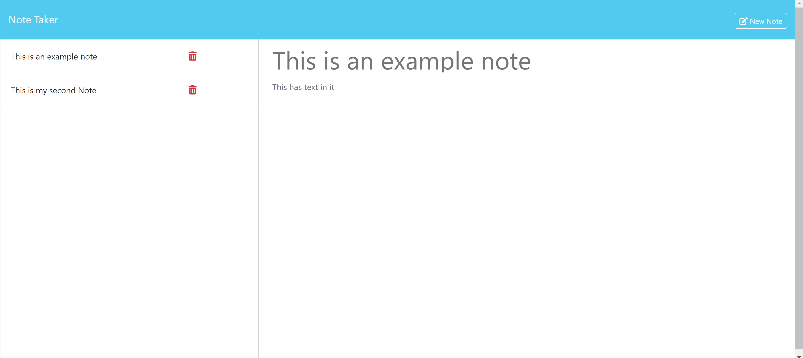

# Note Taker

## Table of Contents

- [Description](#description)
- [Usage](#usage)
- [License](#license)
- [Deployment](#deployment)
- [Questions](#questions)
  
## Description

This site allows you take write and stores notes in an organized and remote location.

## Usage

Use the form to write your notes. All notes need a body and a title and then they will be allowed to be saved.
All saved notes will appear on the lefthand side. Click on any note to view it, and click on New Note
to open the form again after viewing.

## License

This project is protected under the MIT License

## Deployment

Website Link: https://note-taker-u4od.onrender.com/

## Questions

For more questions contact [bewtaich](https://github.com/bewtaich) at <bewtaich@gmail.com>

  